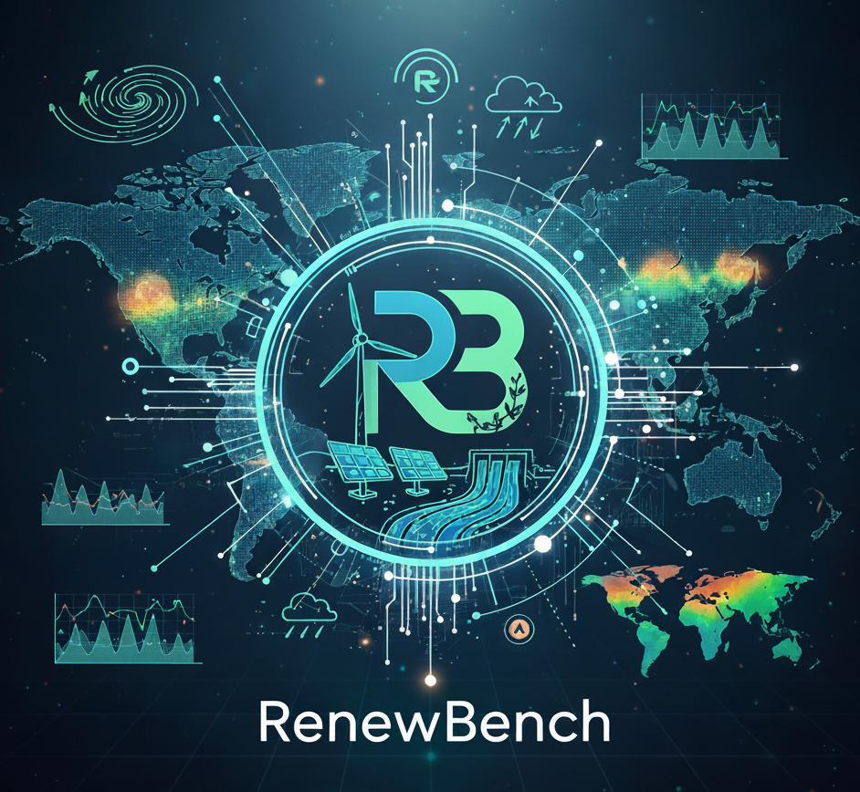

<p align="center">

</p>

# RenewBench Crawlers and Data Processing

[](https://www.python.org/downloads/)
[](https://opensource.org/licenses/MIT)
[](https://github.com/astral-sh/ruff)
[](https://results.pre-commit.ci/latest/github/RenewBench-Association/RenewBench-Crawler/main)
[](renewbench@lists.kit.edu)
[](https://codecov.io/gh/RenewBench-Association/RenewBench-Crawler)

## What is the RenewBench Crawler Repository?

This RenewBench repository contains code to download and process all data that is part of the RenewBench
dataset. This code is available in the RenewBench Crawlers `rcb` python package, and we also include example
configuration files and scripts to run the downloads.

## Installation
We heavily recommend installing the `rcb`package in a dedicated `Python3.11+` virtual environment. You can
install ``rcp`` directly from the GitHub repository via:
```bash
pip install git+https://github.com/RenewBench-Association/RenewBench-Crawler
```
Alternatively, you can install ``rcb`` locally. To achieve this, there are two steps you need to follow:
1. Clone the RenewBench-Crawler repository:
   ```bash
   git clone https://github.com/RenewBench-Association/RenewBench-Crawler
   ```
2. Install the package from the main branch. There are multiple installation options available:
   - Install basic dependencies: ``pip install .``
   - Install an editable version with developer dependencies: ``pip install -e ."[dev]"``

## Structure
The RenewBench-Crawler repository is structured as follows:

```text
.
├── rbc/                     # Main package
│   ├── config/                 # Processing of YAML configs
│   │   ├── loader.py             # Load and validate configs
│   │   └── schema.py             # Pydantic config models and registry
│   ├── energy/                 # Energy data crawlers
│   │   ├── eia/                  # EIA (US)
│   │   ├── entsoe/               # ENTSO-e (EU)
│   │   ├── epias/                # EPIAS (Turkey)
│   │   └── taipower/             # Taipower (Taiwan)
│   └── weather/                # Weather data crawlers
│       ├── era5/                 # ERA5 (Global)
│       └── icon_dream/           # ICON-DREAM (Global/Europe)
│
├── configs/                 # YAML config files
│   ├── energy/                 # Energy source configs (EIA, ENTSO-E, EPIAS, ...)
│   └── weather/                # Weather source configs (ERA5, ICON-DREAM, ...)
│
├── scripts/                 # CLI entry points
│   ├── energy/                 # Scripts for energy sources
│   └── weather/                # Scripts for weather sources
│
├── tests/                   # Test suite
│   ├── config/                 # Tests for configuration schemas & loader
│   ├── energy/                 # Tests for energy sources
│   └── weather/                # Tests for weather sources
│
├── docs/                    # Project docs
│   └── logos/
├── pyproject.toml           # Project configuration
├── .pre-commit-config.yaml  # Pre-commit hooks configuration
└── README.md                # This file
```

## Documentation
Coming soon :fire:

### Data sources

#### Energy

| Region      | Source   | Platform                                                                                                                                                                  | Docs                                                                                                                                                         | Access            | How-to                                                                                                                    |
| ----------- | -------- | ------------------------------------------------------------------------------------------------------------------------------------------------------------------------- | ------------------------------------------------------------------------------------------------------------------------------------------------------------ | ----------------- | ------------------------------------------------------------------------------------------------------------------------- |
| Europe      | Entso-e  | [TP](https://transparency.entsoe.eu/)                                                                                                                                     | [API guide](https://transparencyplatform.zendesk.com/hc/en-us/sections/12783116987028-Restful-API-integration-guide)                                         | API token         | [Registration guide](https://transparencyplatform.zendesk.com/hc/en-us/articles/12845911031188-How-to-get-security-token) |
| Turkey      | EPIAS    | [TP](https://seffaflik.epias.com.tr/home)                                                                                                                                 | [Docs](https://seffaflik.epias.com.tr/electricity-service/technical/en/index.html)                                                                           | Login credentials | [Registration form](https://kayit.epias.com.tr/epias-transparency-platform-registration-form)                             |
| USA         | EIA      | [API browser](www.eia.gov/opendata/browser/)                                                                                                                              | [API docs](https://www.eia.gov/opendata/documentation.php)                                                                                                   | API token         | [Registration form](https://www.eia.gov/opendata/register.php)                                                            |
| Canada      | IESO     |                                                                                                                                                                           |                                                                                                                                                              |                   |                                                                                                                           |
| Canada      | AESO     |                                                                                                                                                                           |                                                                                                                                                              |                   |                                                                                                                           |
| Chile       | CEN      |                                                                                                                                                                           |                                                                                                                                                              |                   |                                                                                                                           |
| Australia   | AEMO     |                                                                                                                                                                           |                                                                                                                                                              |                   |                                                                                                                           |
| New Zealand | EAT      |                                                                                                                                                                           |                                                                                                                                                              |                   |                                                                                                                           |
| Taiwan      | Taipower | [Website](https://www.taipower.com.tw/d006/loadGraph/loadGraph/genshx_e.html)<br>[JSON source](https://www.taipower.com.tw/d006/loadGraph/loadGraph/data/genary_eng.json) | Example downloader from [electricitymaps](https://github.com/electricitymaps/electricitymaps-contrib/blob/master/electricitymap/contrib/parsers/TAIPOWER.py) | -                 | -                                                                                                                         |

#### Weather

| Region | Resolution | Source | Platform                                                                                        | Docs                                                                                 | Access    | How-to                                                             |
| ------ | ------ | ------ |-------------------------------------------------------------------------------------------------| ------------------------------------------------------------------------------------ | --------- | ------------------------------------------------------------------ |
| World  | 0.25° / ~31km | ERA5   | [Copernicus / ECMWF](https://apps.ecmwf.int/data-catalogues/era5/?type=an&class=ea&stream=oper&expver=1) | [Data download guide](https://confluence.ecmwf.int/display/CKB/How+to+download+ERA5) | API token | [Installation guide](https://cds.climate.copernicus.eu/how-to-api) |
| World  | ~13km | ICON DREAM Global   | [DWD](https://opendata.dwd.de/climate_environment/REA/ICON-DREAM-Global/hourly/) | [Guide](http://dx.doi.org/10.5676/dwd/icon-dream_v1) | open | - |
| Europe  | ~6.5km |ICON DREAM Europe  | [DWD](https://opendata.dwd.de/climate_environment/REA/ICON-DREAM-EU/hourly/) | [Guide](http://dx.doi.org/10.5676/dwd/icon-dream_v1) | open | - |

## Guides

### Running scripts

To run the data crawlers, use the scripts in the `scripts` folder. For example:
```commandline
python -m scripts.energy.entsoe_download
```
Each data crawler requires an associated config in the `configs` folder, named as the
data source is, i.e. `configs/entose.yaml`. Required values can be inserted there.

The scripts are also designed as CLIs, so you can provide user arguments via flags.
It is possible to overwrite the YAML config values via commandline, for example:
```commandline
python -m scripts.energy.entsoe_download -o paths.dst_dir_raw=/my/new/path/
```
For more information, use `--help`.

### Including a new data source

To create a data crawler for a new data source, you'll need to amend and
create several files. Here is an overview of the necessary changes to
include your `<source>` for `<type> = energy | weather` data.
 You can always look at other crawlers such as `energy/entsoe` for reference.

1. **Config** ([configs/\<type\>/](configs)): -----
    [Example: _entsoe.yaml_ file](configs/energy/entsoe.yaml)

    Create a `<type>/<source>.yaml` with (at minimum)
    - a destination directory for storing data (`paths/dst_dir_raw`)
    - any potential access information required to crawl the data (`access/...`), i.e.
      API tokens or account log-in data.

2. **Config loader** ([rbc/config/schema.py](rbc/config/schema.py)): -----
   [Example: _EntsoeConfig_ class](rbc/config/schema.py#L75)

    Amend the `rbc/config/schema.py` to
    - include a `class <Source>Config` with the attributes required by the
      `.yaml`.
    - add your class to the `SCHEMA_REGISTRY` at the bottom of the file.

3. **Source folder** ([rbc/\<type\>/\<source\>](rbc)): -----
    [Example: _entsoe_ folder](rbc/energy/entsoe)

    Create a `rbc/<type>/<source>` folder containing
    - a `downloader.py` with a `class <Source>Downloader` to coordinate data crawling.

4. **Script** ([scripts/\<type\>/\<source\>_...py](scripts)): -----
    [Example: _entsoe_download.py_ file](scripts/energy/entsoe_download.py)

    Create a script for each of your source's functionalities from step 3, i.e.
    - a `<type>/<source>_download.py` to run the `downloader.py`.

5. **Tests** ([tests/](tests)):

    Add in tests for your data crawler:
    1. In the `tests/config/conftest.py`, update the dict returned by the
       `source_configs` function to include a dict version of your `<source>.yaml` with
       placeholders,

       --- [Example: _source_configs_ function](tests/config/conftest.py#L16)
    2. In the `tests/<type>/<source>` folder, create a `test_...py` with tests for
       each of the given functionalities, i.e. `test_downloader.py`.

       --- [Example: _test_downloader.py_ file](tests/energy/entsoe/test_downloader.py)

## How to contribute
Check out our [contribution guidelines](CONTRIBUTING.md) if you are interested in contributing to the RenewBench project :fire:.
Please also carefully check our [code of conduct](CODE_OF_CONDUCT.md) :blue_heart:.

## Acknowledgments
This work is funded under the Helmholtz UNLOCK Benchmarking call and supported by the
[Helmholtz AI](https://www.helmholtz.ai/) platform grant.


-----------

<p align="center">
  <a href="http://www.kit.edu/english/index.php"></a><a href="https://www.helmholtz.ai/"></a><a href="https://www.helmholtz.ai/"></a>
</p>
