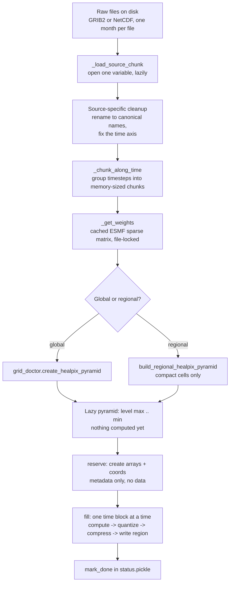

# HEALPix Regridding

## 1. Preface

Every weather model writes its output on its own grid. ERA5 is a regular latitude–longitude raster. BARRA2 is a finer lat–lon raster covering only Australia. ICON-DREAM is an unstructured mesh of ~3 million triangles with no rows or columns at all. Comparing them, or feeding them to one model, means resampling all of them onto **one shared grid**.

That target is **HEALPix**: 12 base quadrilaterals covering the sphere, each recursively subdivided into 4. Level *N* has `12 · 4^N` cells, and **every cell has exactly the same area**.

We store a **pyramid**: the same field at several levels, one Zarr store per level. In `nested` ordering the 4 children of a cell are contiguous, so coarsening is `reshape(-1, 4).mean(axis=1)`. Level 9 is ~3 M cells (~10 km horizontal resolution), level 5 is ~12 k cells (~100 km horizontal resolution).

## 2. The environment

The rest of this repository installs with `pip` into a virtualenv. The regridding needs a conda environment in addition to that.

### 2.1 Why conda is required

The weights of section 5 are computed by ESMF, a compiled Fortran library. ESMF and its `esmpy` bindings are not published on PyPI in any version, so pip cannot install them. The GRIB reader has a milder version of the same problem: `cfgrib` needs the ecCodes C library, and on a cluster it is more reliable to take the library and its bindings from one package manager than to combine a pip wheel's bundled copy with whatever the system provides.

So the regridding runs in a conda-forge environment, created with micromamba. Micromamba is a single static binary, needs no base environment, and installs everything under `$HOME`, which is all a login node normally permits.

The environment is only needed to run a regrid. The unit tests under `tests/weather/regridding/` never generate weights, so they run on `pip install ".[regrid]"` alone, which is what CI does, and everything up to `_get_weights()` imports without ESMF present.

### 2.2 Installing micromamba

Fetch the binary and put it where the batch script expects it:

```bash
mkdir -p "$HOME/.local/bin"
curl -Ls https://micro.mamba.pm/api/micromamba/linux-64/latest \
  | tar -xj --strip-components=1 -C "$HOME/.local/bin" bin/micromamba
```

`MAMBA_ROOT_PREFIX` is the directory the environments are installed into:

```bash
export MAMBA_ROOT_PREFIX="$HOME/micromamba"
eval "$("$HOME/.local/bin/micromamba" shell hook -s bash)"
```

A conda environment is tens of thousands of small files. If `$HOME` has an inode quota, point `MAMBA_ROOT_PREFIX` at a work filesystem instead and change the matching line in the batch script.

### 2.3 Creating the `healpix` environment

From the repository root:

```bash
micromamba create -f environment_healpix.yml
micromamba activate healpix
pip install -e ".[regrid]"
```

[`environment_healpix.yml`](../environment_healpix.yml) holds every dependency with a compiled component; the `regrid` extra in `pyproject.toml` holds the pure-Python ones, including `grid-doctor` and `rbc` itself. pip treats the conda-installed packages as already satisfied and leaves them alone.

The `esmf=*=mpi_openmpi_*` pin selects a build variant rather than a version. esmpy's variants are matched to esmf's, so an unpinned pair can resolve to an MPI build of one and a serial build of the other, which then fail to load together. On a machine without MPI, use `esmf=*=nompi_*` for both.

Check the result:

```bash
python -c "import esmpy, grid_doctor; print(esmpy.__version__)"
```

### 2.4 Activation inside a batch job

This is what the environment block of [`regrid_to_healpix.slurm`](../scripts/weather/slurm/regrid_to_healpix.slurm) does:

```bash
module purge
export MAMBA_ROOT_PREFIX="$HOME/micromamba"
eval "$("$HOME/.local/bin/micromamba" shell hook -s bash)"
micromamba activate "${CONDA_ENV:-healpix}"
```

`module purge` comes first because the cluster's MPI and HDF5 modules are a second copy of libraries the environment already contains, and the linker may resolve against either of them.

A Slurm job runs a non-interactive shell, which never reads `.bashrc`, so the shell function that `micromamba activate` needs does not exist yet; `shell hook` defines it. `MAMBA_ROOT_PREFIX` has to be exported before the hook, because the hook reads it at that point.

Two failure modes: `micromamba: command not found`, because the binary is not on a non-interactive `PATH` and has to be called by absolute path as above; or `activate` reporting success while `python` stays the system one, because the hook is missing or ran before the prefix was set. Both only become visible in the job's `.err` file after the job has started.

## 3. The pipeline



Two properties of this graph matter for the rest of the document:

- **Everything up to `fill` is lazy.** The pyramid is a Dask graph.
- **The unit of work is one `(year, month, variable)` key.** That is what a worker process gets, what succeeds or fails atomically, and what the checkpoint records.

## 4. The input side: GRIB

GRIB is a record format: a file is a concatenation of self-describing messages, one per (variable, level, timestep). Each message carries its own header and its own compressed payload, so there is no global index to find "temperature at level 500 at 06:00"; a reader has to walk the file. `cfgrib` solves this by writing a sidecar `.idx`.

### The two helpers in `grib.py`

`flatten_forecast_dims()`: weather models (including reanalysis models) produce *forecast runs*. A message is stamped with an initialization time plus a lead time ("the 00:00 run, 3 hours ahead"). cfgrib surfaces that as two dimensions, `time × step`. We want the physical timestamp, so the function collapses the pair into **valid time** = init + step and reindexes onto it.

`grib_quantization_step()`: GRIB doesn't store floats. It stores integers plus a per-message recipe:

```
value = (reference + packed_int · 2^E) / 10^D
```

so the representable values form a **lattice** with spacing `2^E / 10^D`. The function reads `binaryScaleFactor` and `decimalScaleFactor` from the headers and returns the finest spacing in the file. That spacing is used again in section 7, where it determines how well the output compresses.

## 5. The regrid itself

Resampling is a sparse matrix multiply. ESMF (Earth System Modeling Framework) computes, once per (source grid, target level), a matrix of area-overlap weights; applying it is `output = W · input`. Building it is expensive, so it's cached as a NetCDF file.

That cache is shared state, so `_get_weights()` builds it under a lock. The lock is a **directory**: `mkdir` either succeeds or fails, atomically, even on a network filesystem.

Regional sources (`regional.py`) take a separate path. The upstream library sizes its output array as `max(row_index) + 1`, which for a regional domain means a global-sized array that is ~94 % zero padding. The local version builds the sparse matrix itself over just the referenced cells.

Runtime split, measured on one block of a 10-level ICON variable: GRIB decode 47 %, regrid 48 %, write 5.8 %.

## 6. The time axis

A Zarr store is a directory of chunk files plus JSON metadata. One store per (model, resolution, level) holds *all* variables, and they **share a single `time` dimension**. The rest of this section follows from that.

### 6.1 Normalizing the time stamps

Different variables are stamped differently even within one product. Instantaneous fields ("time: point") sit on the hour: `01:00`. Hourly means and maxima are labeled at the **center of their interval**: `00:30`. Both conventions are physically sensible, but the two sets of stamps cannot share one axis as they come.

So each source normalizes onto one clock before writing. BARRA2 floors every stamp onto the model's own step:

```python
exact = ds["time"].dt.round("1s")
return ds.assign_coords(time=exact.dt.floor(self.time_freq))
```

The step comes from the source's configured resolution rather than from the file's `cell_methods` attribute, which BARRA2 writes as `interval: 1 hour` in some years and `interval: 1H` in others.

### 6.2 Why the `round("1s")` is there

BARRA2 stores time as **float days since 1949-12-01**. A 20-minute step is `1/72` of a day, which is not representable in binary floating point. Decoded stamps therefore land up to ~256 ns off:

```
00:20:00.000000256    # fine
00:19:59.999999744    # floors to 00:00, a whole step early
```

Flooring a value a nanosecond below a bin edge drops it into the previous bin. Without the rounding, one January of the 20-minute product yields 248 duplicate stamps and 247 forty-minute gaps, and the write fails. Rounding to the nearest second first erases decode noise (which is sub-microsecond) without touching real stamps (which are whole minutes). Measured: hourly and half-hourly stamps survive the same encoding exactly; only the 20-minute product is affected.

More generally, binning a float-decoded quantity is unsafe at the bin boundaries. Round to the resolution the source actually has before flooring.

### 6.3 Reserve first, then fill

A run creates the full time axis for every Zarr level *before* any worker starts, then workers only ever fill regions of it.

The reason is that **Zarr can only grow an array at the end.** Arrays are chunked by index: chunk *k* holds elements `[k·C, (k+1)·C)`. Appending adds new chunk files and bumps the shape, which costs O(new data). Prepending shifts every existing element's index, which invalidates the boundaries of *every chunk of every variable* in the store: a full rewrite, and not atomic.

So if workers ran unordered and one reached February first, the axis would start in February and January could never be added. Reserving up front removes the ordering constraint entirely: months can be written in any order, by any worker, because every slot already exists. It also removes a coordination point: after the reserve, workers touch only their own arrays.

Reserving is nearly free because of two Zarr properties:

- `to_zarr(compute=False)` writes schema and coordinates but **no data chunks** (1.81 s → 0.02 s per level).
- With `write_empty_chunks=False`, a chunk equal to the fill value isn't stored at all. Unwritten time ranges occupy no space; reserving a whole year costs ~0.3 %.

One consequence: for an integer-packed variable the Zarr `fill_value` must be set explicitly from `_FillValue`. Otherwise unwritten gaps read back as `0`, a plausible-looking measurement rather than "missing".

### 6.4 Why a variable can't be added before the store's first stamp

This is the same mechanism seen from the other side. A new variable gets an array spanning the store's **entire existing axis** (NaN where it has no data), so all variables stay aligned on one index. If it also carried data *earlier* than the store's first stamp, the axis itself would have to grow at the front, the prepend that Zarr can't do. Hence the refusal. The error message distinguishes two cases that look identical to the index lookup:

- stamps *before* the store's range → genuinely out of order, regrid chronologically;
- stamps *inside* the range but not on it → wrong clock, as in §6.1.

A v2 of the dataset is planned on **Icechunk**, which versions chunk manifests instead of mutating a directory, so "insert earlier data" becomes a manifest rewrite rather than a data rewrite.

## 7. Compression, and what "lossless" means here

### 7.1 Loss that happens before storage

The regrid is lossy, unavoidably. An area-weighted average of source cells produces values that were never in the source. The rest of this section is about how faithfully that result is stored; it is not a claim that the pyramid equals the original field.

### 7.2 Snapping back onto the source's lattice

From §4 we know GRIB values live on a lattice of spacing `2^E / 10^D`. Averaging produces arbitrary float64 between lattice points: mantissa bits that carry no information the source ever had, and that compress badly, because every value then differs in its low bytes.

`_snap_to_lattice()` rounds back: `round(x / step) * step`. Every source uses power-of-two steps, so this is exact in float32. The error is at most half a step, which is within what the source itself could represent. The digits that are dropped were produced by the averaging and were never present in the source.

### 7.3 The codec pipeline

Two stages, neither of which is worth much alone. Measured on real data:

| pipeline | ratio |
|---|---|
| shuffle only | 1.00× |
| zlib only | 1.48 – 1.69× |
| shuffle + zlib | 2.04 – 2.30× |

**Shuffle** is a byte-plane transpose: for an array of 4-byte values it stores all byte-0s, then all byte-1s, and so on. Being a permutation, it compresses nothing on its own, but it puts similar bytes next to each other. The byte statistics show why that helps: in BARRA2's packed int32, byte 3 is **100 % zero**; in ERA5 float32, byte 3 takes exactly **one** distinct value across the whole array (constant exponent range), and byte 0 takes four (the lattice quantization of §7.2). Interleaved, those runs are invisible to zlib; shuffled, they collapse to almost nothing.

It is the same idea as columnar storage: group by field before compressing.

### 7.4 What is lossless and what is not

- **Codecs (shuffle + zlib/zstd): lossless.** Bit-exact round trip.
- **dtype/packing: lossy relative to float64, exact relative to the source.** BARRA2 is re-packed with the file's *own* `scale_factor`/`add_offset`, so the stored values are the ones BARRA2 itself could express. ERA5 and ICON go to float32 after lattice snapping, which is exact for their step sizes.
- **Lattice snapping: bounded**, error ≤ half a source quantum.

In summary, storage is lossless with respect to the regridded field at the source's own precision. The information loss sits in the regrid itself, which is the point of the exercise, and in the choice not to keep digits the instrument never measured.

### 7.5 Chunking is part of compression

Chunks are the unit of both compression and I/O: a reader pays for whole chunks. The layout targets ~64 MiB uncompressed per chunk, keeps vertical levels whole (there are few and they're read together), splits the `cell` dimension, and uses 24 timesteps per chunk. 24 divides every real month length (hourly months are multiples of 24, 20-minute months of 72), so a month written as one region starts on a chunk boundary and no read-modify-write is needed.

## 8. Parallelism and resume

- **Manager/worker.** One process owns the checkpoint and hands out keys; `ProcessPoolExecutor` + `as_completed` acts as the work queue, so a short 2-D variable never queues behind a long 3-D one.
- **Single writer.** Only the manager writes `status.pickle`, and only after a worker's write returns. A worker that dies mid-write leaves its key unfinished, and a rerun redoes it, because writes are idempotent (same input, same output, same region).
- **Locks only where state is shared.** Creating arrays and coordinates in a store is locked per level store; filling a region is not, because each variable owns its own chunks. Without the lock, several workers create the same shared coordinate at once and the run fails with `ContainsArrayError: An array exists at path 'crs'`.
- **One failure doesn't strand the run.** A raising future is caught per task, logged with its key, and the other results still get recorded. If it escapes the `with` block instead, the pool's shutdown drains every queued task before the exception surfaces, and nothing is checkpointed for as long as that takes.

## 9. Running it

With the `healpix` environment of §2 active, one source at a time:

```bash
python -m scripts.weather.build_healpix_pyramid \
    --sources barra2_r2 \
    --workers 12 \
    -o block_memory_mb=8192 \
    -y 2010
```

Without `-m` it does every month of `-y`, and without `--variables` it regrids whatever it finds on disk for each month. Size `--workers` against `block_memory_mb` rather than against core count: each worker carries its own block budget, roughly 20 GB peak at 8192.

On Slurm there is one script for every source, which takes the source from the environment:

```bash
mkdir -p logs/slurm
sbatch --export=ALL,SOURCE=barra2_r2 scripts/weather/slurm/regrid_to_healpix.slurm
```

Everything else has a default, and Slurm's own flags override the `#SBATCH` ones, which is how a heavier source gets more room:

```bash
sbatch --export=ALL,SOURCE=icon_dream_global,YEARS="2010 2011",WORKERS=17 \
       --time=48:00:00 --job-name=healpix-icon \
       scripts/weather/slurm/regrid_to_healpix.slurm
```

| variable | default | notes |
|---|---|---|
| `SOURCE` | none | required; the job exits 1 without it |
| `YEARS` | `2010` | space-separated list |
| `MONTHS` | every month | space-separated, zero-padded |
| `WORKERS` | `12` | processes in the pool |
| `BLOCK_MEMORY_MB` | `8192` | per-worker block budget |
| `CONDA_ENV` | `healpix` | environment to activate |

**The job re-submits itself.** `--signal=B:USR1@600` tells Slurm to signal the batch shell ten minutes before the time limit; the handler launches an identical job with the same source, years and workers, then exits. Since the checkpoint records every finished `(year, month, variable)` key, the successor skips what its predecessor completed. A regrid that outlasts the queue's time limit therefore finishes without anyone resubmitting it.

## 10. Other things worth knowing

- **`min_level` is a contract**, shared by every source: whatever their native resolution, all of them land on one common coarse level, so any two sources can be compared there. `max_level` is chosen per source, near its native resolution.
- **Variables are renamed to canonical names** at load (`t2m`/`tas` → `2m_temperature`). Everything downstream (store keys, checkpoint keys, CLI arguments) uses the canonical name.
- **Vertical coordinates are structural.** A store holds one coordinate array per dimension name, so variables with different level sets get numbered siblings (`level`, `level_1`). ICON's turbulent kinetic energy lives on 11 *interfaces* where other 3-D fields live on 10 *layers*, which is a real distinction and not an off-by-one.
- **STAC item emission** is currently a no-op hook, reserved for the catalog phase.
